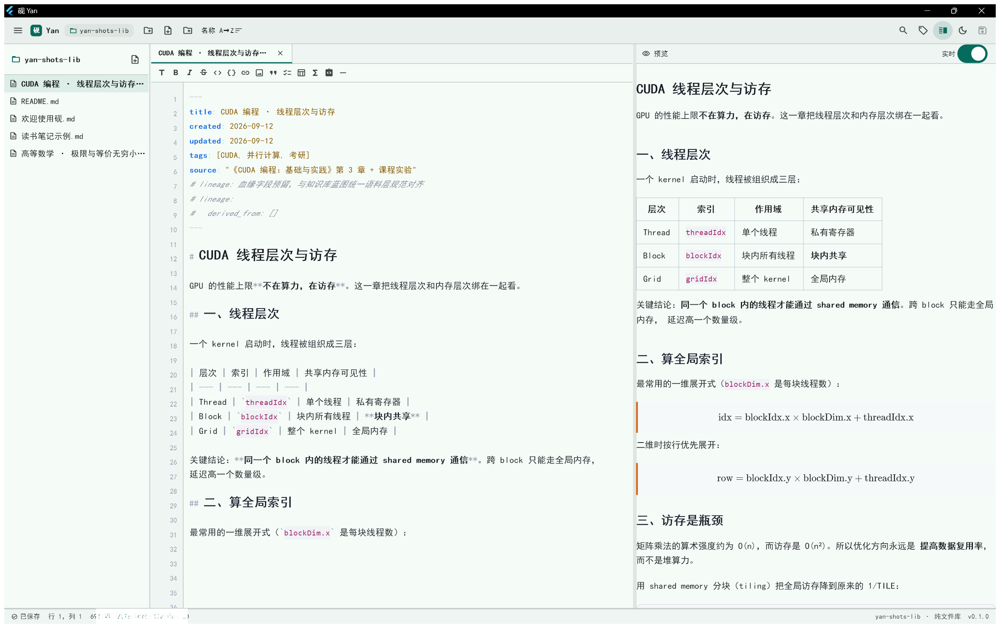
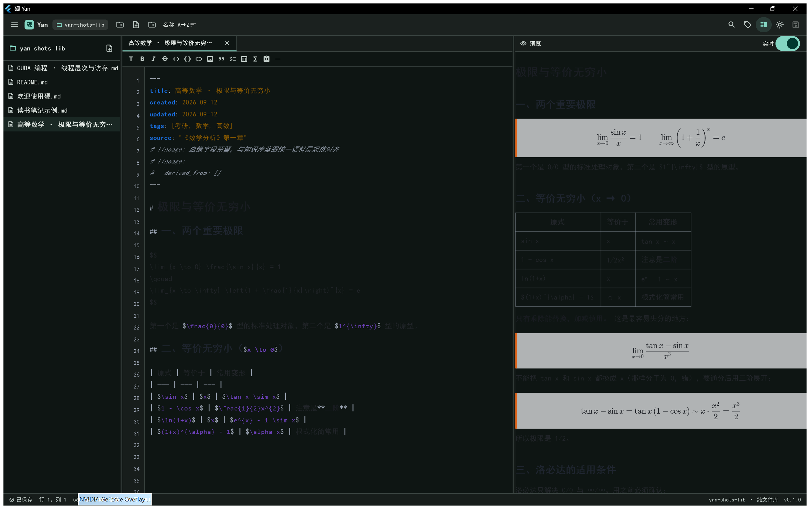
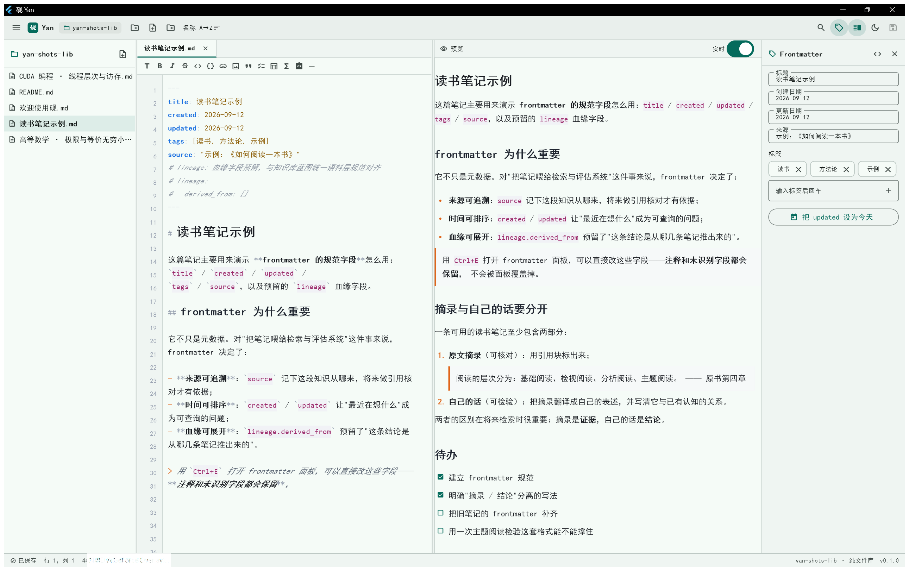

# 砚（Yan）

> 命名：砚——文房四宝中唯一未被占用者；研磨沉淀之意，暗合"语料进、记忆出"。

**纯文件、本地优先的开源 Markdown 编辑器**：一个文件夹就是一个库，笔记是磁盘上真实的 `.md` 文件。
一套 Flutter 代码，目标平台为 Windows / Android / 鸿蒙（HarmonyOS NEXT）。

> ⚠️ 与 MiaoYan（妙言，tw93，macOS 本地优先 MD 应用）**无任何关系**。理念相近，平台错开。

---

## 这个仓库是什么

| 目录 | 内容 |
|---|---|
| `app/` | Flutter 应用本体（v1 全部功能在这里） |
| `docs/` | 设计说明与决策记录 |

应用本身的详细说明见 **[`app/README.md`](app/README.md)**。

---

## 三秒看懂



三栏：**左边文件树、中间源码编辑、右边实时预览**。上面的截图来自真实运行的 Windows 版（`docs/images/` 里的图都是 `app/tool/capture_shots.ps1` 从真实进程抓的，不是效果图）。

| 深色模式 | frontmatter 面板 |
|---|---|
|  |  |

> 说明：**鸿蒙与安卓端尚未适配**（见 roadmap），目前可运行的是 Windows 桌面版。
> 三端截图会在对应平台打通后补齐。

---

## 快速开始

### 直接下载（Windows x64，免安装）

**[⬇ 下载 `yan-0.1.0-windows-x64.zip`](https://github.com/dijia111223/yan/releases/download/v0.1.0/yan-0.1.0-windows-x64.zip)** · [全部版本](https://github.com/dijia111223/yan/releases)

解压后双击 `yan_note.exe` 即可，**已附带 MSVC 运行库，无需安装任何东西**。
想先看效果，可以把 `data/flutter_assets/assets/sample` 当作库打开（内置示例笔记）。

也可以从命令行直接打开库或笔记：

```bat
yan_note.exe --library "D:\我的笔记"
yan_note.exe --library "D:\我的笔记" --open "D:\我的笔记\某篇.md"
yan_note.exe "D:\我的笔记\某篇.md"
```

### 从源码构建

```bash
cd app
flutter pub get
pwsh -File tool/prepare_windows_plugins.ps1   # 仅 Windows，且未开开发者模式时需要
flutter run -d windows
```

打包免安装 zip：`powershell -File app/tool/package_windows.ps1`

详细步骤、快捷键、构建说明见 [`app/README.md`](app/README.md)。

---

## 与知识库蓝图的关系（体用焊接点）

编辑器的 frontmatter 字段 = **统一语料层规范**，是未来 markitdown / 评估套件的直接输入：

```yaml
---
title: 高数 · 极限
created: 2026-09-09
updated: 2026-09-09
tags: [考研, 数学]
source: "《数学分析》第一章"
lineage:              # 血缘字段预留
  derived_from: []
---
```

编辑器 = 个人记忆系统的**采集前端**，不是它的竞争对手。

---

## 许可

MIT，见 [`LICENSE`](LICENSE)。发布时会一并提供第三方依赖许可证清单。
